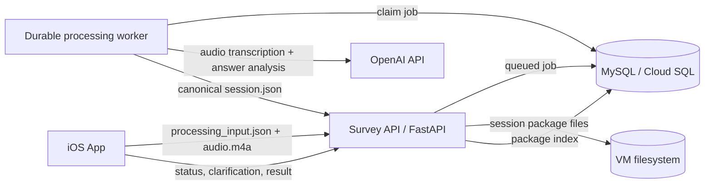

# Questionnaire LLM iOS App

A Swift iOS app for field researchers to collect location-based street assessments. The app durably saves each original `.m4a`, uploads the recording and frozen interview inputs, and immediately returns to collection. A GCP-hosted FastAPI worker uses OpenAI `gpt-4o-mini-transcribe` for speech-to-text and `gpt-4o` for answer analysis, requests interviewer clarification when necessary, and creates the canonical `session.json`.

## Architecture



| Component | Role |
|-----------|------|
| **iOS app** | Durable local recording, GPS/place/no-location resolution, input upload, status/result caching, and clarification UI |
| **Processing worker** | Server-only `gpt-4o-mini-transcribe`, `gpt-4o` answer analysis, completeness recovery, retries, and final package generation |
| **Survey API** (`server/`) | Creates respondent/session IDs, durably accepts audio/input, exposes job/result APIs, and stores packages |
| **MySQL** | Cloud SQL or any MySQL 8+ instance used as an index for session package paths and searchable metadata |

The original audio and `session_state.json` remain protected on the device if upload or processing fails. Transcription and answer analysis require the Survey API and worker.

---

## Prerequisites

### iOS development

- macOS with **Xcode 15+**
- **iOS 17+** (simulator or physical device)
- Apple Developer signing for device installs

### Server-side OpenAI processing

- An OpenAI API key configured only in `server/.env`
- `gpt-4o-mini-transcribe` access for speech-to-text
- A long-running worker process in addition to the FastAPI web process

### Survey API and worker (required for transcription and analysis)

- Python 3.10+
- MySQL database (e.g. Google Cloud SQL) with schema for `respondents` and `survey_sessions`; `schema.sql` adds the session package index table
- A host to run `uvicorn` (GCP VM, Cloud Run, etc.)

---

## Quick start — iOS app

1. **Clone the repository**

   ```bash
   git clone https://github.com/kogawa-hash/ios-voice-llm-survey.git
   cd ios-voice-llm-survey
   ```

2. **Open in Xcode**

   ```bash
   open CounterApp.xcodeproj
   ```

3. **Select a run destination** (simulator or connected iPhone) and press **⌘R**.

4. **Confirm** `CounterApp/questionnaire.json` is present in the project (it ships with the app target).

5. **Configure the app** (gear icon in the navigation bar). See [In-app settings](#in-app-settings) below.

6. **Grant permissions** when prompted:
   - Microphone — recording
   - Location — fresh GPS is attempted before recording; fallback choices permit searched-place or no-location recording

---

## In-app settings

Open **Settings** (gear) from the main screen.

### Processing server

The app stores only the Survey API base URL and optional shared Survey API key. OpenAI credentials and model configuration are server-only and are no longer requested in the active app workflow.

### Location Mode

The main screen always shows the active location behavior. Tap that status card, or open **Settings → Location Mode and Saved Locations**, to choose:

| Mode | Interview behavior |
|------|--------------------|
| **Device Location** | Preserves the existing flow: request fresh GPS, sample a trajectory about every 15 seconds when available, and offer retry, disclosed low-accuracy GPS, Apple Maps place search, no-GPS recording, or cancellation after failure. |
| **Fixed Survey Location** | Prefills the respondent form's Survey Location field with the selected saved place, then uses its device-local snapshot without requesting GPS, showing location-failure prompts, or starting trajectory tracking. |
| **No Location** | Starts without GPS or trajectory tracking and explicitly records that collection was intentionally disabled. |

**Manage Saved Locations** supports any number of places. Additions use native MapKit autocomplete for points of interest and street addresses, resolve ambiguous matches through an explicit chooser, then show the place name, formatted address, map pin, and save action. Apple Maps search requires connectivity. Manual entry accepts a name, exact street address, and optional latitude/longitude. When coordinates are blank, the app searches MapKit using the typed address itself, requires the interviewer to choose among ambiguous address matches, and shows a map confirmation before saving resolved coordinates and the MapKit identifier. If lookup fails or the device is offline, the interviewer can explicitly save an address-only location; it remains usable offline and is never assigned fabricated coordinates.

When an address-only place is active in Fixed Survey Location mode, every later attempt to begin an interview retries that exact address through Apple Maps before questionnaire/respondent intake and before the session location snapshot is created. A single result opens map confirmation; multiple results require the interviewer to choose the correct result and then confirm its pin. Confirmation updates the same saved place with coordinates and its MapKit identifier, so that interview and later interviews can render the point. If lookup is still unavailable, the interviewer can try again, continue with the truthful address-only location, or cancel the interview; a later interview attempt will retry again.

Manual processing retries also inspect the already-saved session snapshot. **Retry Now**, **Retry Selected**, and **Retry All** search Apple Maps when a fixed session contains an address but no coordinates, request selection and map confirmation when needed, and persist the confirmed point into that session's manifest before transcription, analysis, or upload resumes. Any previously generated address-only `session.json` is treated as derived data and rebuilt from the updated manifest before upload. Cancelling the location prompt skips that session; if lookup remains unavailable, the interviewer may explicitly continue processing without a map point.

Both `session_state.json` and `session.json` freeze the selected `location_info` snapshot. Dashboards show fixed-location name and address even when coordinates are unavailable; only map-pin rendering requires coordinates.

Fixed-mode interviews copy the selected location into the durable session manifest before recording. Later edits or deletion of the saved preference do not change earlier sessions. Deleting the active place leaves Fixed Survey Location invalid and blocks interview start until another saved place or another mode is selected; it never silently switches back to GPS.

### Survey API (cloud persistence)

| Setting | When to use |
|---------|-------------|
| **Configure Survey API Base URL** | Base URL of your FastAPI server, e.g. `https://api.example.com` or `http://YOUR_VM_IP:8000` (no trailing slash required) |
| **Configure Survey API Key** | Must match `API_KEY` in `server/.env` if the server enforces it; leave empty if `API_KEY` is unset |
| **Configure Interviewer** | Required before recording; saves interviewer name and normalized email, using the email as the interviewer ID across devices |

When the Survey API is configured:

- Recording creates a local `SurveySessions/<local-session-id>/` folder and atomic `session_state.json` when audio is about to be saved; unuploaded audio and pending work are protected from automatic retention cleanup.
- When capacity information is available, recording is blocked below a 100 MB safety threshold. Stop verifies that the original `.m4a` is readable and nonzero before the interview can reset or begin processing.
- Before recording, the app requires an interviewer profile. If the Survey API is configured, the app resolves/registers the interviewer with `POST /interviewers/resolve`; otherwise it stores the profile locally.
- After **Analyze Answers** from the recording review flow, the app preserves the `.m4a`, freezes questionnaire/respondent/location/interviewer data in `processing_input.json`, queues both files with `POST /sessions/{id}/processing-input`, and immediately returns to the next interview.
- A separate server worker claims the durable MySQL job, transcribes with `gpt-4o-mini-transcribe`, analyzes with `gpt-4o`, and writes audit artifacts without changing the original audio. The prompt reviews every questionnaire question twice; server validation detects spoken question IDs omitted by the first response, runs one targeted recovery pass, and sends any remaining omission to clarification instead of silently dropping it.
- Medium/low-confidence or explicitly ambiguous matches put the job in `needs_review`. The Dashboard fetches the server clarification requests, submits the interviewer's answers with the expected revision, and the server alone generates the final `session.json`.
- Configured follow-ups are stored inside their parent match as a distinct `follow_up` object with the exact follow-up question, an `asked_in_transcript` flag, and independent answer/confidence/clarification fields. A spoken follow-up that lacks a usable answer creates its own follow-up clarification request instead of disappearing or reusing the parent answer.
- The app polls/synchronizes lightweight status on Dashboard refresh and manual retry. When a job completes, it downloads and atomically caches the canonical server result locally for dashboard and aggregation use.
- Completed packages include `interviewer_info`; the server indexes package metadata and extracts matched answers into `analysis_answers` for counting/filtering.
- In Device Location mode, GPS failure does not block recording: the interviewer can retry, accept a disclosed low-accuracy point, record without GPS, search with native MapKit, or cancel. Device-GPS trajectory sampling continues about every 15 seconds when GPS is available.
- `NWPathMonitor` only triggers pending-work discovery. The original recording stays safe locally, while server transcription and analysis can continue even when the app is suspended, terminated, or already recording the next interview.
- Retry and location work are foreground-only. The app does not declare a background execution mode; a reachability callback received while inactive is ignored until a later foreground trigger.

---

## Survey API setup (`server/`)

### 1. Environment

```bash
cd server
cp .env.example .env
```

Edit `.env`:

```bash
MYSQL_HOST=your-mysql-host
MYSQL_PORT=3306
MYSQL_USER=app_user
MYSQL_PASSWORD=your-password
MYSQL_DATABASE=survey

# Optional: require X-API-Key header on protected routes, including admin reads
# Leave empty only for local/private testing.
API_KEY=your-shared-secret

# Optional: where complete session packages are stored on the VM.
# Use an absolute path for production, e.g. /var/lib/ios-voice-llm-survey/session-packages
SURVEY_PACKAGE_STORAGE_DIR=./survey_session_packages
SESSION_JSON_MAX_BYTES=26214400

AUDIO_MAX_BYTES=209715200

# Server-only OpenAI credentials and model choices.
OPENAI_API_KEY=your-openai-api-key
OPENAI_BASE_URL=https://api.openai.com/v1
OPENAI_TRANSCRIPTION_MODEL=gpt-4o-mini-transcribe
OPENAI_ANALYSIS_MODEL=gpt-4o
OPENAI_REQUEST_TIMEOUT_SECONDS=180

# OpenAI transcription uploads are limited separately from legacy package audio.
TRANSCRIPTION_AUDIO_MAX_BYTES=26214400
PROCESSING_JOB_MAX_ATTEMPTS=5
PROCESSING_JOB_LEASE_SECONDS=600
PROCESSING_WORKER_IDLE_SECONDS=3
```

`SURVEY_PACKAGE_STORAGE_DIR` is read by the server from `.env`; it is not hardcoded in the iOS app. When it is set to `./survey_session_packages` and the FastAPI service runs from the `server/` directory, packages are saved under:

```text
<repo>/server/survey_session_packages/
```

For a production VM, prefer an absolute path owned by the server user, for example:

```text
/var/lib/ios-voice-llm-survey/session-packages/
```

Each submitted interview gets one cloud-session folder. Audit artifacts appear as processing advances:

```text
survey_session_packages/
└── <cloud-session-id>/
    ├── processing_input.json
    ├── recording_....m4a
    ├── transcript.txt
    ├── raw_transcription_response.json
    ├── raw_analysis_response.json
    ├── raw_analysis_recovery_response.json  # only when spoken questions were initially omitted
    ├── draft_analysis.json
    └── session.json
```

`session.json` is created only after analysis is accepted or all clarification requests are resolved. Follow-up answers remain nested under their stable parent question ID, while the native and web dashboards label them as `Q# Follow-up`; SQL analysis indexes them separately as `<question-id>:follow_up`. The original `.m4a` is never replaced by a derived file.

### 2. Install and run

```bash
python3 -m venv .venv
source .venv/bin/activate   # Windows: .venv\Scripts\activate
pip install -r requirements.txt
uvicorn app.main:app --host 0.0.0.0 --port 8000
```

Run the durable worker as a separate long-running service from the same release and environment:

```bash
python -m app.processing_worker
```

In production, manage the API and worker as separate `systemd`, container, or process-manager services. Do not replace the worker with a FastAPI in-process background task; queued rows and expired leases are what make processing recoverable across restarts.

Verify:

```bash
curl http://localhost:8000/health
# {"ok":true}
```

Use HTTPS in production, or configure firewall rules so only trusted clients reach the API.

### 3. Database schema

Ensure MySQL has the existing `respondents` and `survey_sessions` tables. Then apply the package index and analysis schema:

```bash
mysql -h "$MYSQL_HOST" -u "$MYSQL_USER" -p "$MYSQL_DATABASE" < schema.sql
```

After deploying this package-only API version and confirming that no older clients still call the removed row-based endpoints, back up the database and optionally remove their tables:

```bash
mysql -h "$MYSQL_HOST" -u "$MYSQL_USER" -p "$MYSQL_DATABASE" < scripts/drop_legacy_storage.sql
```

The migration is intentionally not run automatically. Legacy VM files under the former `AUDIO_STORAGE_DIR` and legacy iPad `SurveyExports` or `pending_trajectory_points.json` files should be reviewed and removed separately because they may contain user data from older builds.

For an existing database that already has `session_packages`, run the additive interviewer migration:

```bash
python3 scripts/add_interviewer_schema.py
```

For an existing database that already has `session_packages` and `analysis_answers`, run the additive questionnaire metadata migration:

```bash
python3 scripts/add_questionnaire_schema.py
```

For durable idempotent cloud-session creation, run the additive local-session mapping migration:

```bash
python3 scripts/add_session_idempotency_schema.py
```

For an existing database, add the durable server processing queue:

```bash
python3 scripts/add_server_processing_schema.py
```

New clients send optional `local_session_id` to `POST /sessions`. Repeating the same request returns the original respondent/session identity. Older clients may omit the field.

To let the web admin dashboard attach a location to packages that originally recorded no location, run the additive admin-location migration:

```bash
python3 scripts/add_admin_location_override_schema.py
```

The admin override is stored only in the `session_packages` index. FastAPI returns it as `admin_location_override` from the admin detail endpoint without rewriting the uploaded `session.json`, so the original field record remains intact.

### 4. Questionnaire rows

The admin dashboard is the intended place to create, edit, publish, archive, and delete test questionnaire versions. The iOS app downloads published questionnaire versions, caches them for field use, and sends the selected questionnaire identity plus its question snapshot in the frozen processing input so each schema-v3 `session.json` remains historically interpretable.

Use the seed script to publish the bundled app questionnaire as the first server-managed questionnaire version:

```bash
export $(grep -v '^#' .env | xargs)
python3 scripts/seed_questions.py ../CounterApp/questionnaire.json
```

To populate `analysis_answers` from packages that were uploaded before the analysis table existed:

```bash
python3 scripts/backfill_analysis_answers.py
```

### 5. API surface

| Method | Path | Description |
|--------|------|-------------|
| `GET` | `/health` | Health check |
| `GET` | `/questionnaires/active` | List published questionnaire versions for the iOS app |
| `GET` | `/admin/questionnaires` | Admin only: list draft/published/archived questionnaire versions |
| `POST` | `/admin/questionnaires` | Admin only: create a draft questionnaire version |
| `PUT` | `/admin/questionnaires/{questionnaire_id}/versions/{version}` | Admin only: update a draft questionnaire version |
| `POST` | `/admin/questionnaires/{questionnaire_id}/versions/{version}/publish` | Admin only: publish a draft questionnaire version |
| `POST` | `/admin/questionnaires/{questionnaire_id}/versions/{version}/archive` | Admin only: archive a questionnaire version |
| `DELETE` | `/admin/questionnaires/{questionnaire_id}/versions/{version}` | Admin only: delete a questionnaire version; `force=true` clears SQL references for test cleanup |
| `GET` | `/admin/sessions` | Admin only: list uploaded session packages, newest interview recording start first |
| `GET` | `/admin/sessions/{session_id}` | Admin only: return the stored `session.json` for one package |
| `GET` | `/admin/sessions/{session_id}/audio` | Admin only: stream the original package audio inline, or download it with `?download=true` |
| `PUT` | `/admin/sessions/{session_id}/location` | Admin only: add or revise a separate location override when the original package has no location |
| `DELETE` | `/admin/sessions/{session_id}` | Admin only: delete one uploaded package folder plus related MySQL rows |
| `POST` | `/interviewers/resolve` | Resolve/register interviewer name and normalized email; email is used as `interviewer_id` |
| `POST` | `/sessions` | Create respondent + session |
| `POST` | `/sessions/{session_id}/package` | Upload `session.json` plus the audio file into one server folder; MySQL stores the package index and extracted analysis rows |
| `POST` | `/sessions/{session_id}/processing-input` | Durably upload frozen interview input plus original `.m4a` and queue server processing |
| `GET` | `/processing-jobs/{session_id}` | Fetch lightweight queued/transcribing/analyzing/needs-review/completed/failed status |
| `POST` | `/processing-jobs/{session_id}/retry` | Requeue a failed job after an interviewer retry |
| `GET` | `/processing-jobs/{session_id}/result` | Return the completed canonical `session.json` |
| `POST` | `/processing-jobs/{session_id}/clarifications` | Save interviewer corrections against an expected JSON revision |

Authenticated requests send header `X-API-Key: <API_KEY>` when `API_KEY` is set in `.env`.
Read-only admin requests use the same `X-API-Key: <API_KEY>` header when `API_KEY` is set.

### 6. Point the iOS app at the server

In app **Settings**:

- **Survey API Base URL** — e.g. `http://YOUR_VM_IP:8000`
- **Survey API Key** — same value as `API_KEY` in `.env` (if used)
- **Interviewer Profile** — interviewer name and email; the app lowercases/trims the email and uses it as the interviewer ID.

---

## Native iOS dashboard

The iOS app includes a native **Dashboard** button on the main screen. It is intentionally data-light:

- The dashboard opens immediately with sessions already available on the device.
- The Dashboard remains accessible when there are no local or cached sessions. Its empty state explains that the device has no saved sessions and keeps Refresh available for checking the server.
- Unfinished local work appears in a separate **Unprocessed Sessions** section. Completed/uploaded device and cached-server copies remain under **Sessions on this device**, and server-only rows remain under **Available on server**.
- Local sessions come from `Documents/SurveySessions/<local-session-id>/session_state.json` and/or a completed `session.json`, so recordings awaiting upload or server processing remain visible after relaunch.
- Rows and detail views show the server-backed state: not submitted, queued, transcribing, analyzing, clarification required, completed, retryable failure, or terminal failure. Local saving alone is never labeled **Uploaded** or **Analysis complete**.
- **Retry Now**, **Retry All**, and selected-session retry submit eligible recordings sequentially and synchronize existing jobs. They never run Apple Speech or an LLM on the device.
- A clarification-required session opens the server's question, proposed answer, and the relevant question-and-answer transcript segment. The server fuzzy-matches the spoken question and stops the excerpt before the next questionnaire question instead of showing the beginning of the interview. The interviewer can choose a structured Yes/No or multiple-choice answer, enter a custom answer, and add a note. Submission is revision-checked so stale screens cannot overwrite a newer result.
- Completed results are downloaded from `GET /processing-jobs/{session_id}/result` and atomically cached as the same schema-v3 `session.json` used by the server package index.
- Detail views explicitly say when the original recording is safe on the device and preserve nullable/pending location state without mislabeling searched places as GPS. Location correction is handled by the separate authenticated web admin dashboard.
- Device-mode Apple Maps fallback locations appear as non-GPS pins in the native map. The dashboard uses saved coordinates when available and can resolve an older searched-place package's stored address for display when its coordinate fields are missing, without rewriting the canonical session JSON.
- Session rows and detail pages show the interviewer saved in `interviewer_info`.
- Tapping the dashboard refresh button calls `GET /admin/sessions` and fetches only the lightweight server session list.
- Server-only sessions appear under **Available on server**.
- Tapping one server-only row then calls `GET /admin/sessions/{session_id}` to download that one full `session.json`.
- Downloaded server packages are cached under `Documents/DashboardCache/<server-session-id>/session.json`.
- Cached server packages appear under **Sessions on this device** and can be opened again without another full download.
- Detail pages can delete the device-local copy only after confirmation. For local sessions this removes the `SurveySessions/<local-session-id>/` folder from the iPad and warns when it may be the only unuploaded copy; for cached server sessions this removes only the `DashboardCache/<server-session-id>/` copy. It does not delete the uploaded server package.

The dashboard uses the same **Survey API Base URL** and **Survey API Key** configured in app Settings. There is no separate admin API key.

The route map is rendered natively with MapKit from `trajectory_points` in `session.json`. It does not require live location permission just to view a saved route, but map tiles may require network access.

---

## Server processing deployment

Run the FastAPI web process and `python -m app.processing_worker` as independent services against the same MySQL database and package directory. Only the server receives the OpenAI key. The public API should use HTTPS; if a development VM uses cleartext HTTP, its address must be covered by the app's App Transport Security configuration.

---

## Usage workflow

1. **Start Interview** — configure the current interviewer if needed, confirm the visible Location Mode, and submit respondent info. Device Location attempts fresh GPS and preserves the existing fallback flow. Fixed Survey Location and No Location skip GPS prompts and trajectory tracking.
2. **Review Recording** — after Stop & Review, play the audio without closing the review popup, then analyze or discard the recording.
3. **Send for Processing** — from the review popup, the app freezes interview inputs, uploads them with the original audio, and returns to **Start Interview**. The worker transcribes and analyzes independently on the server.
4. **Clarify Answers** — Dashboard sessions marked as needing review show server-generated clarification requests. The interviewer selects or types a final answer and may add a note; the server applies it and writes the canonical JSON.
5. **Durable save and retry** — upload failures remain safe and actionable on the device; server failures remain in the durable queue with bounded attempts and an explicit retry API.
6. **Session Tools / Dashboard** — export or share completed packages, review Unprocessed Sessions, synchronize status, clarify one session, or retry selected uploads sequentially.
7. **Dashboard** — reviews local/cached sessions, refreshes the lightweight server session list on demand, and downloads a full server `session.json` only when a server row is opened.
8. **Aggregate** — summarizes analyzed local `SurveySessions/*/session.json` packages on device.

The outbox creates/reuses a cloud session keyed by the local session ID and uploads immutable processing input plus audio. On the VM, look under `SURVEY_PACKAGE_STORAGE_DIR/<cloud-session-id>/` for the input, audit artifacts, final `session.json`, and audio file. MySQL `processing_jobs` holds durable workflow state, `session_packages` stores the completed package index, and `analysis_answers` stores one extracted row per matched question.

The generated schema-v3 `session.json` is ordered for human review: metadata and IDs appear first, respondent/audio/location context comes next, and the transcript plus matched answers appear at the bottom. The v3 respondent shape uses optional `email` and does not emit `phone`. Every new package adds a typed `location_info` snapshot with `mode`, `collection_method`, place identity/address when applicable, and nullable coordinates. Older packages without `location_info` remain readable. Device interview paths are saved in `trajectory_points`; fixed and intentionally disabled sessions use an empty trajectory and explain why in `location_info` rather than creating fake points.

---

## Project structure

```
ios-voice-llm-survey/
├── CounterApp.xcodeproj
├── CounterApp/
│   ├── ViewController.swift           # Main voice survey UI
│   ├── LLMService.swift               # Legacy/local compatibility; not used by the active interview flow
│   ├── SurveyAPIClient.swift          # Processing-input, status, clarification, result, and admin API client
│   ├── DeferredSessionOutbox.swift     # Durable audio submission, status sync, and result caching
│   ├── LocalSessionManifest.swift      # Atomic session_state.json recovery model
│   ├── SurveyLocationSettings.swift    # Location modes, saved-place model, UserDefaults store
│   ├── SurveyLocationViewControllers.swift # UIKit settings, MapKit search/confirmation, manual entry
│   ├── TrajectoryTracker.swift        # Fresh GPS attempt, quality mapping, and trajectory sampling
│   ├── SessionManager.swift           # Local session folders
│   ├── MapViewController.swift        # Map-first entry (optional)
│   ├── LocalSessionDashboardViewController.swift # Local/server session dashboard + MapKit route viewer
│   ├── questionnaire.json
│   └── ...
├── CounterAppTests/
├── CounterAppUITests/
├── server/
│   ├── app/main.py                    # FastAPI intake, processing-job, result, and admin API
│   ├── app/processing_worker.py       # Separate durable queue worker process
│   ├── app/server_processing.py       # OpenAI transcription, analysis, and package generation
│   ├── schema.sql                     # processing queue + package/questionnaire/analysis tables
│   ├── scripts/seed_questions.py
│   ├── scripts/drop_legacy_storage.sql # optional post-deployment legacy table cleanup
│   ├── scripts/add_questionnaire_schema.py
│   ├── scripts/add_session_idempotency_schema.py
│   ├── scripts/add_admin_location_override_schema.py
│   ├── scripts/add_server_processing_schema.py
│   ├── requirements.txt
│   ├── .env.example
│   ├── survey_session_packages/       # runtime only: uploaded session packages, ignored by Git
│   │   └── <cloud-session-id>/
│   │       ├── session.json
│   │       └── recording_....m4a
└── README.md
```

---

## Troubleshooting

| Issue | What to check |
|-------|----------------|
| Server transcription/analysis does not start | Worker process is running; `OPENAI_API_KEY` is set only on the server; `processing_jobs` migration is applied |
| OpenAI transcription fails | Audio is below `TRANSCRIPTION_AUDIO_MAX_BYTES`; worker can reach `OPENAI_BASE_URL`; `OPENAI_TRANSCRIPTION_MODEL=gpt-4o-mini-transcribe` |
| Survey API 401 | `X-API-Key` in app matches `API_KEY` in `.env` |
| Dashboard server refresh fails | Survey API Base URL/Key are configured in app Settings; FastAPI is reachable; `/admin/sessions` returns 200 |
| Dashboard server row does not open | `/admin/sessions/{session_id}` can read the server package `session.json`; `SURVEY_PACKAGE_STORAGE_DIR` points to the package folders |
| Processing upload fails with schema error | Apply `server/schema.sql` on a new DB or run `scripts/add_server_processing_schema.py` on an existing DB |
| Questionnaire manager/API fails with missing columns | Run `server/scripts/add_questionnaire_schema.py` on existing databases, then seed/publish a questionnaire |
| Cannot find answers/transcript on server | Open `SURVEY_PACKAGE_STORAGE_DIR/<session-id>/session.json`; new uploads no longer store full answers/transcripts as MySQL rows |
| iOS cannot reach HTTP server | ATS / use HTTPS; VM firewall allows device IP |
| Package/audio not uploading | `SURVEY_PACKAGE_STORAGE_DIR` writable on server; Survey API configured; cloud session created |
| Job stays queued | Start `python -m app.processing_worker` and confirm it points to the same MySQL database and `SURVEY_PACKAGE_STORAGE_DIR` as FastAPI |
| Clarification submission returns a conflict | Refresh the Dashboard; another client or worker revision changed the job, so the stale clarification screen must not overwrite it |
| Cleartext blocked | Add VM host to `NSAppTransportSecurity` in `Info.plist` or use TLS |

---

## Tech stack

- **iOS:** Swift, UIKit, AVFoundation, Core Location, MapKit (the Speech framework remains only in legacy compatibility code, not the active interview path)
- **Server:** FastAPI, uvicorn, PyMySQL, python-dotenv
- **Database:** MySQL 8+ (Cloud SQL compatible)

---

## Contributing

Issues and pull requests are welcome.

## License

Educational and research use. Adapt freely for your own study workflows.
