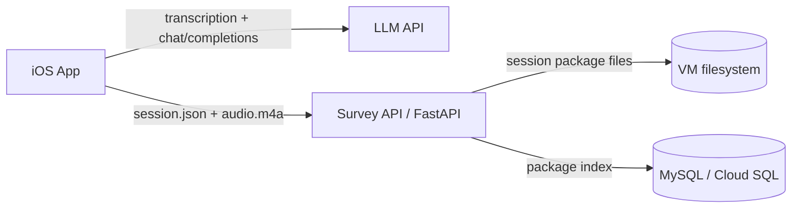

# Questionnaire LLM iOS App

A Swift iOS app for field researchers to collect location-based street assessments. Participants record spoken responses; the interviewer can use device GPS, an offline saved fixed survey location, or intentionally collect no location. The app transcribes audio, matches answers to survey questions with an LLM, and durably uploads one complete interview package to a backend (FastAPI + MySQL / Cloud SQL).

## Architecture



| Component | Role |
|-----------|------|
| **iOS app** | Durable local recording, GPS/place/no-location resolution, speech-to-text, LLM matching, local JSON export, and deferred cloud upload |
| **LLM** | OpenAI, Gemini, or a **self-hosted OpenAI-compatible** endpoint on a VM |
| **Survey API** (`server/`) | Creates respondent/session IDs, stores each interview folder on the VM, and writes a lightweight MySQL index |
| **MySQL** | Cloud SQL or any MySQL 8+ instance used as an index for session package paths and searchable metadata |

You can run in **local-only** mode (export JSON on device, no server) or **full study** mode (Survey API + database + optional VM LLM).

---

## Prerequisites

### iOS development

- macOS with **Xcode 15+**
- **iOS 17+** (simulator or physical device)
- Apple Developer signing for device installs

### LLM (pick one)

- **OpenAI** API key — [platform.openai.com/api-keys](https://platform.openai.com/api-keys) (recommended)
- **Gemini** API key — [Google AI Studio](https://aistudio.google.com/apikey)
- **Self-hosted** OpenAI-compatible API on a VM (Ollama + proxy, vLLM, etc.)

### Survey API (optional, for cloud storage)

- Python 3.10+
- MySQL database (e.g. Google Cloud SQL) with schema for `respondents` and `survey_sessions`; `schema.sql` adds the session package index table
- A host to run `uvicorn` (GCP VM, Cloud Run, etc.)

---

## Quick start — iOS app

1. **Clone the repository**

   ```bash
   git clone https://github.com/kogawa-hash/ios-voice-llm-survey.git
   cd ios-voice-llm-survey
   ```

2. **Open in Xcode**

   ```bash
   open CounterApp.xcodeproj
   ```

3. **Select a run destination** (simulator or connected iPhone) and press **⌘R**.

4. **Confirm** `CounterApp/questionnaire.json` is present in the project (it ships with the app target).

5. **Configure the app** (gear icon in the navigation bar). See [In-app settings](#in-app-settings) below.

6. **Grant permissions** when prompted:
   - Microphone — recording
   - Speech recognition — transcription
   - Location — fresh GPS is attempted before recording; fallback choices permit searched-place or no-location recording

---

## In-app settings

Open **Settings** (gear) from the main screen.

### LLM

| Setting | When to use |
|---------|-------------|
| **Select API Provider** | OpenAI (default) or Gemini |
| **Configure OpenAI / Gemini API Key** | Required for cloud LLM providers |
| **Configure Custom LLM Base URL** | Point at a self-hosted OpenAI-compatible API, e.g. `http://YOUR_VM_IP:11434/v1` |

**Self-hosted LLM (VM):**

1. Set provider to **OpenAI**.
2. Set **Custom LLM Base URL** to your proxy base including `/v1` (the app calls `{baseURL}/chat/completions`).
3. Enter any non-empty API key if your proxy does not require one (e.g. `local`).
4. Your proxy must accept model name **`gpt-4o-mini`** (hardcoded in the app) or map that name to your local model.
5. Allow long responses: the iOS client uses a **180s** timeout for OpenAI-style requests.

**Public OpenAI / Gemini:** leave Custom LLM Base URL empty and use a real API key for the selected provider.

### Location Mode

The main screen always shows the active location behavior. Tap that status card, or open **Settings → Location Mode and Saved Locations**, to choose:

| Mode | Interview behavior |
|------|--------------------|
| **Device Location** | Preserves the existing flow: request fresh GPS, sample a trajectory about every 15 seconds when available, and offer retry, disclosed low-accuracy GPS, Apple Maps place search, no-GPS recording, or cancellation after failure. |
| **Fixed Survey Location** | Prefills the respondent form's Survey Location field with the selected saved place, then uses its device-local snapshot without requesting GPS, showing location-failure prompts, or starting trajectory tracking. |
| **No Location** | Starts without GPS or trajectory tracking and explicitly records that collection was intentionally disabled. |

**Manage Saved Locations** supports any number of places. Additions use native MapKit autocomplete for points of interest and street addresses, resolve ambiguous matches through an explicit chooser, then show the place name, formatted address, map pin, and save action. Apple Maps search requires connectivity. Manual entry accepts a name, exact street address, and optional latitude/longitude. When coordinates are blank, the app searches MapKit using the typed address itself, requires the interviewer to choose among ambiguous address matches, and shows a map confirmation before saving resolved coordinates and the MapKit identifier. If lookup fails or the device is offline, the interviewer can explicitly save an address-only location; it remains usable offline and is never assigned fabricated coordinates.

When an address-only place is active in Fixed Survey Location mode, every later attempt to begin an interview retries that exact address through Apple Maps before questionnaire/respondent intake and before the session location snapshot is created. A single result opens map confirmation; multiple results require the interviewer to choose the correct result and then confirm its pin. Confirmation updates the same saved place with coordinates and its MapKit identifier, so that interview and later interviews can render the point. If lookup is still unavailable, the interviewer can try again, continue with the truthful address-only location, or cancel the interview; a later interview attempt will retry again.

Manual processing retries also inspect the already-saved session snapshot. **Retry Now**, **Retry Selected**, and **Retry All** search Apple Maps when a fixed session contains an address but no coordinates, request selection and map confirmation when needed, and persist the confirmed point into that session's manifest before transcription, analysis, or upload resumes. Any previously generated address-only `session.json` is treated as derived data and rebuilt from the updated manifest before upload. Cancelling the location prompt skips that session; if lookup remains unavailable, the interviewer may explicitly continue processing without a map point.

Both `session_state.json` and `session.json` freeze the selected `location_info` snapshot. Dashboards show fixed-location name and address even when coordinates are unavailable; only map-pin rendering requires coordinates.

Fixed-mode interviews copy the selected location into the durable session manifest before recording. Later edits or deletion of the saved preference do not change earlier sessions. Deleting the active place leaves Fixed Survey Location invalid and blocks interview start until another saved place or another mode is selected; it never silently switches back to GPS.

### Survey API (cloud persistence)

| Setting | When to use |
|---------|-------------|
| **Configure Survey API Base URL** | Base URL of your FastAPI server, e.g. `https://api.example.com` or `http://YOUR_VM_IP:8000` (no trailing slash required) |
| **Configure Survey API Key** | Must match `API_KEY` in `server/.env` if the server enforces it; leave empty if `API_KEY` is unset |
| **Configure Interviewer** | Required before recording; saves interviewer name and normalized email, using the email as the interviewer ID across devices |

When the Survey API is configured:

- Recording creates a local `SurveySessions/<local-session-id>/` folder and atomic `session_state.json` when audio is about to be saved; unuploaded audio and pending work are protected from automatic retention cleanup.
- When capacity information is available, recording is blocked below a 100 MB safety threshold. Stop verifies that the original `.m4a` is readable and nonzero before the interview can reset or begin processing.
- Before recording, the app requires an interviewer profile. If the Survey API is configured, the app resolves/registers the interviewer with `POST /interviewers/resolve`; otherwise it stores the profile locally.
- After **Analyze Answers** from the recording review flow, the app writes `session.json` into that local session folder.
- Each `session.json` includes `interviewer_info` with `interviewer_id`, `name`, `email`, and `identity_scope`.
- If any matched answer has medium/low confidence or needs clarification, the interviewer can select or type a final answer before the package is saved.
- If the Survey API is configured, the app uploads `session.json` and the original `.m4a` together to `POST /sessions/{id}/package`. Launch, foreground, and satisfied network-path callbacks only discover saved work and ask before opening the Dashboard; they do not silently process old sessions. The interviewer can process one session from its detail page or select several eligible sessions for sequential processing.
- The server stores both files under one VM folder, writes a package index row to MySQL, indexes interviewer fields, and extracts matched answers into `analysis_answers` for easier counting/filtering.
- In Device Location mode, GPS failure does not block recording: the interviewer can retry, accept a disclosed low-accuracy point, record without GPS, search with native MapKit, or cancel. Device-GPS trajectory sampling continues about every 15 seconds when GPS is available.
- `NWPathMonitor` only triggers pending-work discovery; actual user-approved Speech, LLM, HTTP, and server responses determine success. iOS does not guarantee processing while the app is suspended or terminated because this phase does not add a background-task mechanism.
- Retry and location work are foreground-only. The app does not declare a background execution mode; a reachability callback received while inactive is ignored until a later foreground trigger.

---

## Survey API setup (`server/`)

### 1. Environment

```bash
cd server
cp .env.example .env
```

Edit `.env`:

```bash
MYSQL_HOST=your-mysql-host
MYSQL_PORT=3306
MYSQL_USER=app_user
MYSQL_PASSWORD=your-password
MYSQL_DATABASE=survey

# Optional: require X-API-Key header on protected routes, including admin reads
# Leave empty only for local/private testing.
API_KEY=your-shared-secret

# Optional: where complete session packages are stored on the VM.
# Use an absolute path for production, e.g. /var/lib/ios-voice-llm-survey/session-packages
SURVEY_PACKAGE_STORAGE_DIR=./survey_session_packages
SESSION_JSON_MAX_BYTES=26214400

AUDIO_MAX_BYTES=209715200
```

`SURVEY_PACKAGE_STORAGE_DIR` is read by the server from `.env`; it is not hardcoded in the iOS app. When it is set to `./survey_session_packages` and the FastAPI service runs from the `server/` directory, packages are saved under:

```text
<repo>/server/survey_session_packages/
```

For a production VM, prefer an absolute path owned by the server user, for example:

```text
/var/lib/ios-voice-llm-survey/session-packages/
```

Each uploaded interview gets one cloud-session folder:

```text
survey_session_packages/
└── <cloud-session-id>/
    ├── session.json
    └── recording_....m4a
```

The `.m4a` recording is stored beside `session.json` in this package folder.

### 2. Install and run

```bash
python3 -m venv .venv
source .venv/bin/activate   # Windows: .venv\Scripts\activate
pip install -r requirements.txt
uvicorn app.main:app --host 0.0.0.0 --port 8000
```

Verify:

```bash
curl http://localhost:8000/health
# {"ok":true}
```

Use HTTPS in production, or configure firewall rules so only trusted clients reach the API.

### 3. Database schema

Ensure MySQL has the existing `respondents` and `survey_sessions` tables. Then apply the package index and analysis schema:

```bash
mysql -h "$MYSQL_HOST" -u "$MYSQL_USER" -p "$MYSQL_DATABASE" < schema.sql
```

After deploying this package-only API version and confirming that no older clients still call the removed row-based endpoints, back up the database and optionally remove their tables:

```bash
mysql -h "$MYSQL_HOST" -u "$MYSQL_USER" -p "$MYSQL_DATABASE" < scripts/drop_legacy_storage.sql
```

The migration is intentionally not run automatically. Legacy VM files under the former `AUDIO_STORAGE_DIR` and legacy iPad `SurveyExports` or `pending_trajectory_points.json` files should be reviewed and removed separately because they may contain user data from older builds.

For an existing database that already has `session_packages`, run the additive interviewer migration:

```bash
python3 scripts/add_interviewer_schema.py
```

For an existing database that already has `session_packages` and `analysis_answers`, run the additive questionnaire metadata migration:

```bash
python3 scripts/add_questionnaire_schema.py
```

For durable idempotent cloud-session creation, run the additive local-session mapping migration:

```bash
python3 scripts/add_session_idempotency_schema.py
```

New clients send optional `local_session_id` to `POST /sessions`. Repeating the same request returns the original respondent/session identity. Older clients may omit the field.

To let the web admin dashboard attach a location to packages that originally recorded no location, run the additive admin-location migration:

```bash
python3 scripts/add_admin_location_override_schema.py
```

The admin override is stored only in the `session_packages` index. FastAPI returns it as `admin_location_override` from the admin detail endpoint without rewriting the uploaded `session.json`, so the original field record remains intact.

### 4. Questionnaire rows

The admin dashboard is the intended place to create, edit, publish, archive, and delete test questionnaire versions. The iOS app downloads published questionnaire versions, caches them for field use, and stores the selected questionnaire identity plus its question snapshot in each schema-v2 `session.json` so historical answers remain interpretable.

Use the seed script to publish the bundled app questionnaire as the first server-managed questionnaire version:

```bash
export $(grep -v '^#' .env | xargs)
python3 scripts/seed_questions.py ../CounterApp/questionnaire.json
```

To populate `analysis_answers` from packages that were uploaded before the analysis table existed:

```bash
python3 scripts/backfill_analysis_answers.py
```

### 5. API surface

| Method | Path | Description |
|--------|------|-------------|
| `GET` | `/health` | Health check |
| `GET` | `/questionnaires/active` | List published questionnaire versions for the iOS app |
| `GET` | `/admin/questionnaires` | Admin only: list draft/published/archived questionnaire versions |
| `POST` | `/admin/questionnaires` | Admin only: create a draft questionnaire version |
| `PUT` | `/admin/questionnaires/{questionnaire_id}/versions/{version}` | Admin only: update a draft questionnaire version |
| `POST` | `/admin/questionnaires/{questionnaire_id}/versions/{version}/publish` | Admin only: publish a draft questionnaire version |
| `POST` | `/admin/questionnaires/{questionnaire_id}/versions/{version}/archive` | Admin only: archive a questionnaire version |
| `DELETE` | `/admin/questionnaires/{questionnaire_id}/versions/{version}` | Admin only: delete a questionnaire version; `force=true` clears SQL references for test cleanup |
| `GET` | `/admin/sessions` | Admin only: list uploaded session packages, newest interview recording start first |
| `GET` | `/admin/sessions/{session_id}` | Admin only: return the stored `session.json` for one package |
| `PUT` | `/admin/sessions/{session_id}/location` | Admin only: add or revise a separate location override when the original package has no location |
| `DELETE` | `/admin/sessions/{session_id}` | Admin only: delete one uploaded package folder plus related MySQL rows |
| `POST` | `/interviewers/resolve` | Resolve/register interviewer name and normalized email; email is used as `interviewer_id` |
| `POST` | `/sessions` | Create respondent + session |
| `POST` | `/sessions/{session_id}/package` | Upload `session.json` plus the audio file into one server folder; MySQL stores the package index and extracted analysis rows |

Authenticated requests send header `X-API-Key: <API_KEY>` when `API_KEY` is set in `.env`.
Read-only admin requests use the same `X-API-Key: <API_KEY>` header when `API_KEY` is set.

### 6. Point the iOS app at the server

In app **Settings**:

- **Survey API Base URL** — e.g. `http://YOUR_VM_IP:8000`
- **Survey API Key** — same value as `API_KEY` in `.env` (if used)
- **Interviewer Profile** — interviewer name and email; the app lowercases/trims the email and uses it as the interviewer ID.

---

## Native iOS dashboard

The iOS app includes a native **Dashboard** button on the main screen. It is intentionally data-light:

- The dashboard opens immediately with sessions already available on the device.
- The Dashboard remains accessible when there are no local or cached sessions. Its empty state explains that the device has no saved sessions and keeps Refresh available for checking the server.
- Unfinished local work appears in a separate **Unprocessed Sessions** section. Completed/uploaded device and cached-server copies remain under **Sessions on this device**, and server-only rows remain under **Available on server**.
- Local sessions come from `Documents/SurveySessions/<local-session-id>/session_state.json` and/or `session.json`, so recordings awaiting transcription or analysis remain visible after relaunch.
- Rows and detail views derive truthful status from the manifest: locally saved recording, missing/low-accuracy/manual location, pending transcription/analysis/clarification/upload, scheduled retry, uploaded, or action-required failure. Local saving alone is never labeled **Uploaded** or **Analysis complete**.
- A pending local session shows **Retry Now** when it has eligible recoverable work. Manual retry bypasses its scheduled backoff but remains protected against duplicate concurrent processing.
- **Retry All** processes every eligible unfinished session sequentially with one confirmation. Select mode remains available when the interviewer wants to retry only a subset. It never starts concurrent Speech/LLM jobs; sessions requiring interviewer clarification remain unprocessed and must be opened individually.
- Sequential batch transcription retains partial Speech segments until each recording reaches its final result, then fully releases that request before starting the next recording. This prevents a final callback containing only the last answer from replacing the earlier interview transcript.
- Users never choose between retry and re-transcription. **Retry Now** and **Retry All** inspect durable state automatically: transcripts from before the corrected cumulative Speech pipeline are rebuilt once from the original `.m4a`; current transcripts resume at analysis; human clarification is preserved; and finalized current packages retry upload only.
- When a batch retry completes analysis without needing clarification, durable processing atomically creates the same schema-v2 `session.json` package used by the interactive flow and continues directly to the existing idempotent upload path. A missing final package or pending clarification always remains actionable in the session detail view.
- Detail views explicitly say when the original recording is safe on the device and preserve nullable/pending location state without mislabeling searched places as GPS. Location correction is handled by the separate authenticated web admin dashboard.
- Session rows and detail pages show the interviewer saved in `interviewer_info`.
- Tapping the dashboard refresh button calls `GET /admin/sessions` and fetches only the lightweight server session list.
- Server-only sessions appear under **Available on server**.
- Tapping one server-only row then calls `GET /admin/sessions/{session_id}` to download that one full `session.json`.
- Downloaded server packages are cached under `Documents/DashboardCache/<server-session-id>/session.json`.
- Cached server packages appear under **Sessions on this device** and can be opened again without another full download.
- Detail pages can delete the device-local copy only after confirmation. For local sessions this removes the `SurveySessions/<local-session-id>/` folder from the iPad and warns when it may be the only unuploaded copy; for cached server sessions this removes only the `DashboardCache/<server-session-id>/` copy. It does not delete the uploaded server package.

The dashboard uses the same **Survey API Base URL** and **Survey API Key** configured in app Settings. There is no separate admin API key.

The route map is rendered natively with MapKit from `trajectory_points` in `session.json`. It does not require live location permission just to view a saved route, but map tiles may require network access.

---

## Self-hosted LLM on a VM (outline)

This repo does not include the LLM proxy itself; the iOS app expects an **OpenAI-compatible** HTTP API. A typical GCP setup:

1. **VM** with Ollama (or similar) listening on an internal port (e.g. `11434`).
2. **Small proxy** (FastAPI/Flask) that exposes `POST /v1/chat/completions`, forwards to Ollama, and maps model `gpt-4o-mini` to your local model name.
3. **Firewall**: open the proxy port to your study devices (or use VPN), not necessarily the raw Ollama port.
4. **iOS**: Custom LLM Base URL = `http://VM_IP:PROXY_PORT/v1`, provider = OpenAI, placeholder API key if unused.

Use a **different port** than the Survey API unless a reverse proxy routes `/v1` vs `/sessions` on one host.

**HTTP on device:** iOS blocks cleartext HTTP unless allowed in App Transport Security. `Info.plist` may list specific VM IPs; for a new host, add an ATS exception in Xcode or serve the LLM over HTTPS.

---

## Usage workflow

1. **Start Interview** — configure the current interviewer if needed, confirm the visible Location Mode, and submit respondent info. Device Location attempts fresh GPS and preserves the existing fallback flow. Fixed Survey Location and No Location skip GPS prompts and trajectory tracking.
2. **Review Recording** — after Stop & Review, play the audio without closing the review popup, then analyze or discard the recording.
3. **Analyze Answers** — from the review popup, transcribes the recording (English locale), sends the transcript to the configured LLM, and shows matched questions and extracted answers.
4. **Clarify Answers** — for medium/low-confidence answers or answers marked as needing clarification, select or type the final answer and optionally add a note. The JSON keeps both the original LLM answer and the manual correction.
5. **Durable save and retry** — after analysis/clarification atomically saves `session.json`, the main screen returns to **Start Interview**. Immediate upload is attempted when configured; failures remain pending with bounded backoff and can be retried from Session Tools.
6. **Session Tools / Dashboard** — export or share saved packages, review the separate Unprocessed Sessions section, process one session interactively, or select eligible sessions for sequential processing.
7. **Dashboard** — reviews local/cached sessions, refreshes the lightweight server session list on demand, and downloads a full server `session.json` only when a server row is opened.
8. **Aggregate** — summarizes analyzed local `SurveySessions/*/session.json` packages on device.

If Survey API is configured, the outbox uploads the complete session package after any required clarification is resolved. It creates/reuses a cloud session keyed by the local session ID, persists those IDs, and marks upload complete only after validating the server response. On the VM, look under `SURVEY_PACKAGE_STORAGE_DIR/<cloud-session-id>/` for `session.json` and the audio file. MySQL `session_packages` stores the lookup/index row, and `analysis_answers` stores one extracted row per matched question.

The generated schema-v3 `session.json` is ordered for human review: metadata and IDs appear first, respondent/audio/location context comes next, and the transcript plus matched answers appear at the bottom. The v3 respondent shape uses optional `email` and does not emit `phone`. Every new package adds a typed `location_info` snapshot with `mode`, `collection_method`, place identity/address when applicable, and nullable coordinates. Older packages without `location_info` remain readable. Device interview paths are saved in `trajectory_points`; fixed and intentionally disabled sessions use an empty trajectory and explain why in `location_info` rather than creating fake points.

---

## Project structure

```
ios-voice-llm-survey/
├── CounterApp.xcodeproj
├── CounterApp/
│   ├── ViewController.swift           # Main voice survey UI
│   ├── LLMService.swift               # OpenAI / Gemini / custom base URL
│   ├── SurveyAPIClient.swift          # FastAPI client
│   ├── DeferredSessionOutbox.swift     # Folder scanner, backoff, cloud identity + package retry
│   ├── LocalSessionManifest.swift      # Atomic session_state.json recovery model
│   ├── SurveyLocationSettings.swift    # Location modes, saved-place model, UserDefaults store
│   ├── SurveyLocationViewControllers.swift # UIKit settings, MapKit search/confirmation, manual entry
│   ├── TrajectoryTracker.swift        # Fresh GPS attempt, quality mapping, and trajectory sampling
│   ├── SessionManager.swift           # Local session folders
│   ├── MapViewController.swift        # Map-first entry (optional)
│   ├── LocalSessionDashboardViewController.swift # Local/server session dashboard + MapKit route viewer
│   ├── questionnaire.json
│   └── ...
├── CounterAppTests/
├── CounterAppUITests/
├── server/
│   ├── app/main.py                    # FastAPI Survey API
│   ├── schema.sql                     # package index + questionnaire/analysis tables
│   ├── scripts/seed_questions.py
│   ├── scripts/drop_legacy_storage.sql # optional post-deployment legacy table cleanup
│   ├── scripts/add_questionnaire_schema.py
│   ├── scripts/add_session_idempotency_schema.py
│   ├── scripts/add_admin_location_override_schema.py
│   ├── requirements.txt
│   ├── .env.example
│   ├── survey_session_packages/       # runtime only: uploaded session packages, ignored by Git
│   │   └── <cloud-session-id>/
│   │       ├── session.json
│   │       └── recording_....m4a
└── README.md
```

---

## Troubleshooting

| Issue | What to check |
|-------|----------------|
| LLM timeout / failure | VM proxy running; model name mapping for `gpt-4o-mini`; timeout ≥ 180s on proxy chain |
| Survey API 401 | `X-API-Key` in app matches `API_KEY` in `.env` |
| Dashboard server refresh fails | Survey API Base URL/Key are configured in app Settings; FastAPI is reachable; `/admin/sessions` returns 200 |
| Dashboard server row does not open | `/admin/sessions/{session_id}` can read the server package `session.json`; `SURVEY_PACKAGE_STORAGE_DIR` points to the package folders |
| Package upload fails with schema error | Apply `server/schema.sql` so `session_packages` and `analysis_answers` exist |
| Questionnaire manager/API fails with missing columns | Run `server/scripts/add_questionnaire_schema.py` on existing databases, then seed/publish a questionnaire |
| Cannot find answers/transcript on server | Open `SURVEY_PACKAGE_STORAGE_DIR/<session-id>/session.json`; new uploads no longer store full answers/transcripts as MySQL rows |
| iOS cannot reach HTTP server | ATS / use HTTPS; VM firewall allows device IP |
| Package/audio not uploading | `SURVEY_PACKAGE_STORAGE_DIR` writable on server; Survey API configured; cloud session created |
| Retried transcript contains only the last answer | Install a build containing the batch Speech fix and press the normal **Retry Now** or **Retry All** action. The app automatically rebuilds transcripts created by the older transcription pipeline from their original audio. |
| Session says `Final Package missing` after Retry All | Install a build containing the durable package-finalization fix and press **Retry Now** or **Retry All** again. Analysis-complete sessions now rebuild `session.json` from their manifest, transcript, matches, and original audio before upload; the recovery action is no longer hidden. |
| Cleartext blocked | Add VM host to `NSAppTransportSecurity` in `Info.plist` or use TLS |

---

## Tech stack

- **iOS:** Swift, UIKit, AVFoundation, Speech, Core Location, MapKit
- **Server:** FastAPI, uvicorn, PyMySQL, python-dotenv
- **Database:** MySQL 8+ (Cloud SQL compatible)

---

## Contributing

Issues and pull requests are welcome.

## License

Educational and research use. Adapt freely for your own study workflows.
