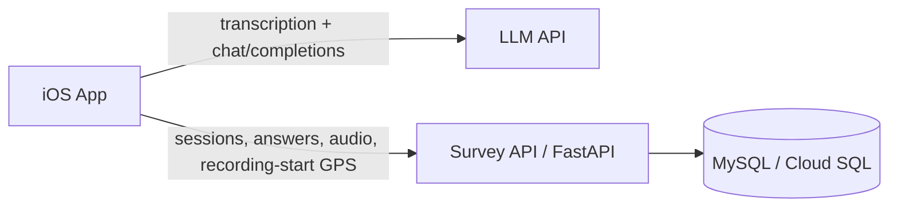

# Questionnaire LLM iOS App

A Swift iOS app for field researchers to collect location-based street assessments. Participants record spoken responses; the app captures a required GPS point at recording start, transcribes audio, matches answers to survey questions with an LLM, and optionally uploads results, recording audio, and interview coordinates to a backend (FastAPI + MySQL / Cloud SQL).

## Architecture



| Component | Role |
|-----------|------|
| **iOS app** | Required recording-start GPS capture, audio recording, speech-to-text, LLM matching, local JSON export, optional cloud upload |
| **LLM** | OpenAI, Gemini, or a **self-hosted OpenAI-compatible** endpoint on a VM |
| **Survey API** (`server/`) | Persists respondents, sessions, answers, recording-start GPS points, and uploaded audio metadata/files |
| **MySQL** | Cloud SQL or any MySQL 8+ instance the Survey API connects to |

You can run in **local-only** mode (export JSON on device, no server) or **full study** mode (Survey API + database + optional VM LLM).

---

## Prerequisites

### iOS development

- macOS with **Xcode 15+**
- **iOS 17+** (simulator or physical device)
- Apple Developer signing for device installs

### LLM (pick one)

- **OpenAI** API key — [platform.openai.com/api-keys](https://platform.openai.com/api-keys) (recommended)
- **Gemini** API key — [Google AI Studio](https://aistudio.google.com/apikey)
- **Self-hosted** OpenAI-compatible API on a VM (Ollama + proxy, vLLM, etc.)

### Survey API (optional, for cloud storage)

- Python 3.10+
- MySQL database (e.g. Google Cloud SQL) with schema for `respondents`, `survey_sessions`, `questions`, `answers`
- A host to run `uvicorn` (GCP VM, Cloud Run, etc.)

---

## Quick start — iOS app

1. **Clone the repository**

   ```bash
   git clone https://github.com/kogawa-hash/ios-voice-llm-survey.git
   cd ios-voice-llm-survey
   ```

2. **Open in Xcode**

   ```bash
   open CounterApp.xcodeproj
   ```

3. **Select a run destination** (simulator or connected iPhone) and press **⌘R**.

4. **Confirm** `CounterApp/questionnaire.json` is present in the project (it ships with the app target).

5. **Configure the app** (gear icon in the navigation bar). See [In-app settings](#in-app-settings) below.

6. **Grant permissions** when prompted:
   - Microphone — recording
   - Speech recognition — transcription
   - Location — required one-time GPS capture before each recording starts

---

## In-app settings

Open **Settings** (gear) from the main screen.

### LLM

| Setting | When to use |
|---------|-------------|
| **Select API Provider** | OpenAI (default) or Gemini |
| **Configure OpenAI / Gemini API Key** | Required for cloud LLM providers |
| **Configure Custom LLM Base URL** | Point at a self-hosted OpenAI-compatible API, e.g. `http://YOUR_VM_IP:11434/v1` |

**Self-hosted LLM (VM):**

1. Set provider to **OpenAI**.
2. Set **Custom LLM Base URL** to your proxy base including `/v1` (the app calls `{baseURL}/chat/completions`).
3. Enter any non-empty API key if your proxy does not require one (e.g. `local`).
4. Your proxy must accept model name **`gpt-4o-mini`** (hardcoded in the app) or map that name to your local model.
5. Allow long responses: the iOS client uses a **180s** timeout for OpenAI-style requests.

**Public OpenAI / Gemini:** leave Custom LLM Base URL empty and use a real API key for the selected provider.

### Survey API (cloud persistence)

| Setting | When to use |
|---------|-------------|
| **Configure Survey API Base URL** | Base URL of your FastAPI server, e.g. `https://api.example.com` or `http://YOUR_VM_IP:8000` (no trailing slash required) |
| **Configure Survey API Key** | Must match `API_KEY` in `server/.env` if the server enforces it; leave empty if `API_KEY` is unset |

When the Survey API is configured:

- After **LLM Recognition**, matched answers are posted to `POST /sessions/{id}/answers`.
- The current recording is uploaded to `POST /sessions/{id}/audio` and stored under `AUDIO_STORAGE_DIR` on the server.
- The GPS point captured at **recording start** is uploaded to `POST /respondents/{id}/trajectory` with provider `recording-start`.
- Failed answer uploads are **queued locally** and retried on the next launch.
- Recording is blocked if the app cannot retrieve a current GPS coordinate.

---

## Survey API setup (`server/`)

### 1. Environment

```bash
cd server
cp .env.example .env
```

Edit `.env`:

```bash
MYSQL_HOST=your-mysql-host
MYSQL_PORT=3306
MYSQL_USER=app_user
MYSQL_PASSWORD=your-password
MYSQL_DATABASE=survey

# Optional: require X-API-Key header on all mutating routes (leave empty to disable)
API_KEY=your-shared-secret

# Optional: where uploaded audio files are stored on the VM.
# Use an absolute path for production, e.g. /var/lib/ios-voice-llm-survey/audio
AUDIO_STORAGE_DIR=./uploaded_audio
AUDIO_MAX_BYTES=209715200
```

### 2. Install and run

```bash
python3 -m venv .venv
source .venv/bin/activate   # Windows: .venv\Scripts\activate
pip install -r requirements.txt
uvicorn app.main:app --host 0.0.0.0 --port 8000
```

Verify:

```bash
curl http://localhost:8000/health
# {"ok":true}
```

Use HTTPS in production, or configure firewall rules so only trusted clients reach the API.

### 3. Database schema

Ensure MySQL has tables for respondents, sessions, questions, and answers (your existing study schema). Then apply recording-start GPS and audio upload support:

```bash
mysql -h "$MYSQL_HOST" -u "$MYSQL_USER" -p "$MYSQL_DATABASE" < schema.sql
```

### 4. Seed questionnaire rows

Answer inserts reference `questions.id`. Load rows from the app’s questionnaire file:

```bash
export $(grep -v '^#' .env | xargs)
python3 scripts/seed_questions.py ../CounterApp/questionnaire.json
```

### 5. API surface

| Method | Path | Description |
|--------|------|-------------|
| `GET` | `/health` | Health check |
| `POST` | `/sessions` | Create respondent + session |
| `POST` | `/sessions/{session_id}/answers` | Batch upload LLM-matched answers |
| `POST` | `/sessions/{session_id}/audio` | Upload the session recording to VM-local storage |
| `POST` | `/respondents/{respondent_id}/trajectory` | Upload the recording-start GPS point |
| `GET` | `/respondents/{respondent_id}/trajectory` | Read back stored GPS points |
| `POST` | `/llm-events` | Optional LLM telemetry |

Authenticated requests send header `X-API-Key: <API_KEY>` when `API_KEY` is set in `.env`.

### 6. Point the iOS app at the server

In app **Settings**:

- **Survey API Base URL** — e.g. `http://YOUR_VM_IP:8000`
- **Survey API Key** — same value as `API_KEY` in `.env` (if used)

---

## Self-hosted LLM on a VM (outline)

This repo does not include the LLM proxy itself; the iOS app expects an **OpenAI-compatible** HTTP API. A typical GCP setup:

1. **VM** with Ollama (or similar) listening on an internal port (e.g. `11434`).
2. **Small proxy** (FastAPI/Flask) that exposes `POST /v1/chat/completions`, forwards to Ollama, and maps model `gpt-4o-mini` to your local model name.
3. **Firewall**: open the proxy port to your study devices (or use VPN), not necessarily the raw Ollama port.
4. **iOS**: Custom LLM Base URL = `http://VM_IP:PROXY_PORT/v1`, provider = OpenAI, placeholder API key if unused.

Use a **different port** than the Survey API unless a reverse proxy routes `/v1` vs `/sessions` on one host.

**HTTP on device:** iOS blocks cleartext HTTP unless allowed in App Transport Security. `Info.plist` may list specific VM IPs; for a new host, add an ATS exception in Xcode or serve the LLM over HTTPS.

---

## Usage workflow

1. **Record** — tap Record, submit respondent info, wait for the required GPS point, speak, tap again to stop. If GPS is unavailable, recording does not start.
2. **Play** (optional) — review the recording.
3. **Transcribe** — runs automatically after recording (English locale).
4. **LLM Recognition** — sends the transcript to the configured LLM; shows matched questions and extracted answers.
5. **Respondent info** — prompted when exporting or as part of your study flow.
6. **Export JSON** — saves session data under the app Documents directory (`SurveySessions/`).
7. **Aggregate** — summarizes previously exported JSON files on device.

If Survey API is configured, step 4 also uploads the saved recording-start GPS point, matched answers, and the audio recording to the server where possible.

---

## Project structure

```
ios-voice-llm-survey/
├── CounterApp.xcodeproj
├── CounterApp/
│   ├── ViewController.swift           # Main voice survey UI
│   ├── LLMService.swift               # OpenAI / Gemini / custom base URL
│   ├── SurveyAPIClient.swift          # FastAPI client
│   ├── TrajectoryTracker.swift        # Required recording-start GPS capture/upload
│   ├── SessionManager.swift           # Local session folders
│   ├── PendingSurveyUploadStore.swift # Offline answer queue
│   ├── MapViewController.swift        # Map-first entry (optional)
│   ├── questionnaire.json
│   └── ...
├── CounterAppTests/
├── CounterAppUITests/
├── server/
│   ├── app/main.py                    # FastAPI Survey API
│   ├── schema.sql                     # trajectory_points table
│   ├── scripts/seed_questions.py
│   ├── requirements.txt
│   └── .env.example
└── README.md
```

---

## Troubleshooting

| Issue | What to check |
|-------|----------------|
| LLM timeout / failure | VM proxy running; model name mapping for `gpt-4o-mini`; timeout ≥ 180s on proxy chain |
| Survey API 401 | `X-API-Key` in app matches `API_KEY` in `.env` |
| Answers 400 / FK error | Run `seed_questions.py` so `questions` rows exist for each `question_id` |
| iOS cannot reach HTTP server | ATS / use HTTPS; VM firewall allows device IP |
| GPS point not uploading | Survey API configured; cloud session created; Location permission allowed; recording sidecar JSON has `recording_start_trajectory_point` |
| Audio not uploading | `AUDIO_STORAGE_DIR` writable on server; `audio_recordings` table exists; recording sidecar JSON is not already marked uploaded |
| Cleartext blocked | Add VM host to `NSAppTransportSecurity` in `Info.plist` or use TLS |

---

## Tech stack

- **iOS:** Swift, UIKit, AVFoundation, Speech, Core Location, MapKit
- **Server:** FastAPI, uvicorn, PyMySQL, python-dotenv
- **Database:** MySQL 8+ (Cloud SQL compatible)

---

## Contributing

Issues and pull requests are welcome.

## License

Educational and research use. Adapt freely for your own study workflows.
