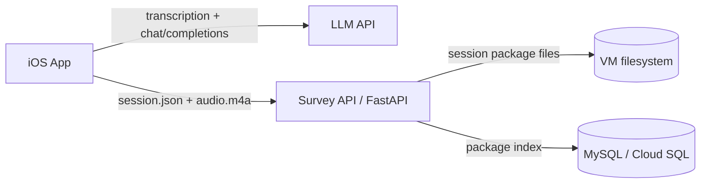

# Questionnaire LLM iOS App

A Swift iOS app for field researchers to collect location-based street assessments. Participants record spoken responses; the app captures a required GPS point at recording start, transcribes audio, matches answers to survey questions with an LLM, and optionally uploads one complete interview package to a backend (FastAPI + MySQL / Cloud SQL).

## Architecture



| Component | Role |
|-----------|------|
| **iOS app** | Required recording-start GPS capture, audio recording, speech-to-text, LLM matching, local JSON export, optional cloud upload |
| **LLM** | OpenAI, Gemini, or a **self-hosted OpenAI-compatible** endpoint on a VM |
| **Survey API** (`server/`) | Creates respondent/session IDs, stores each interview folder on the VM, and writes a lightweight MySQL index |
| **MySQL** | Cloud SQL or any MySQL 8+ instance used as an index for session package paths and searchable metadata |

You can run in **local-only** mode (export JSON on device, no server) or **full study** mode (Survey API + database + optional VM LLM).

---

## Prerequisites

### iOS development

- macOS with **Xcode 15+**
- **iOS 17+** (simulator or physical device)
- Apple Developer signing for device installs

### LLM (pick one)

- **OpenAI** API key — [platform.openai.com/api-keys](https://platform.openai.com/api-keys) (recommended)
- **Gemini** API key — [Google AI Studio](https://aistudio.google.com/apikey)
- **Self-hosted** OpenAI-compatible API on a VM (Ollama + proxy, vLLM, etc.)

### Survey API (optional, for cloud storage)

- Python 3.10+
- MySQL database (e.g. Google Cloud SQL) with schema for `respondents` and `survey_sessions`; `schema.sql` adds the session package index table
- A host to run `uvicorn` (GCP VM, Cloud Run, etc.)

---

## Quick start — iOS app

1. **Clone the repository**

   ```bash
   git clone https://github.com/kogawa-hash/ios-voice-llm-survey.git
   cd ios-voice-llm-survey
   ```

2. **Open in Xcode**

   ```bash
   open CounterApp.xcodeproj
   ```

3. **Select a run destination** (simulator or connected iPhone) and press **⌘R**.

4. **Confirm** `CounterApp/questionnaire.json` is present in the project (it ships with the app target).

5. **Configure the app** (gear icon in the navigation bar). See [In-app settings](#in-app-settings) below.

6. **Grant permissions** when prompted:
   - Microphone — recording
   - Speech recognition — transcription
   - Location — required one-time GPS capture before each recording starts

---

## In-app settings

Open **Settings** (gear) from the main screen.

### LLM

| Setting | When to use |
|---------|-------------|
| **Select API Provider** | OpenAI (default) or Gemini |
| **Configure OpenAI / Gemini API Key** | Required for cloud LLM providers |
| **Configure Custom LLM Base URL** | Point at a self-hosted OpenAI-compatible API, e.g. `http://YOUR_VM_IP:11434/v1` |

**Self-hosted LLM (VM):**

1. Set provider to **OpenAI**.
2. Set **Custom LLM Base URL** to your proxy base including `/v1` (the app calls `{baseURL}/chat/completions`).
3. Enter any non-empty API key if your proxy does not require one (e.g. `local`).
4. Your proxy must accept model name **`gpt-4o-mini`** (hardcoded in the app) or map that name to your local model.
5. Allow long responses: the iOS client uses a **180s** timeout for OpenAI-style requests.

**Public OpenAI / Gemini:** leave Custom LLM Base URL empty and use a real API key for the selected provider.

### Survey API (cloud persistence)

| Setting | When to use |
|---------|-------------|
| **Configure Survey API Base URL** | Base URL of your FastAPI server, e.g. `https://api.example.com` or `http://YOUR_VM_IP:8000` (no trailing slash required) |
| **Configure Survey API Key** | Must match `API_KEY` in `server/.env` if the server enforces it; leave empty if `API_KEY` is unset |

When the Survey API is configured:

- Recording creates a local `SurveySessions/<local-session-id>/` folder only when audio is about to be saved; metadata-only empty folders are cleaned up automatically.
- After **Analyze Answers** from the recording review flow, the app writes `session.json` into that local session folder.
- If any matched answer has medium/low confidence or needs clarification, the interviewer can select or type a final answer before the package is saved.
- If the Survey API is configured, the app uploads `session.json` and the `.m4a` recording together to `POST /sessions/{id}/package`.
- The server stores both files under one VM folder, writes a package index row to MySQL, and extracts matched answers into `analysis_answers` for easier counting/filtering.
- Recording is blocked if the app cannot retrieve a current GPS coordinate, then the app samples the latest available location about every 15 seconds while recording.

---

## Survey API setup (`server/`)

### 1. Environment

```bash
cd server
cp .env.example .env
```

Edit `.env`:

```bash
MYSQL_HOST=your-mysql-host
MYSQL_PORT=3306
MYSQL_USER=app_user
MYSQL_PASSWORD=your-password
MYSQL_DATABASE=survey

# Optional: require X-API-Key header on protected routes, including admin reads
# Leave empty only for local/private testing.
API_KEY=your-shared-secret

# Optional: where complete session packages are stored on the VM.
# Use an absolute path for production, e.g. /var/lib/ios-voice-llm-survey/session-packages
SURVEY_PACKAGE_STORAGE_DIR=./survey_session_packages
SESSION_JSON_MAX_BYTES=26214400

# Legacy audio-only endpoint storage. New app uploads use SURVEY_PACKAGE_STORAGE_DIR.
AUDIO_STORAGE_DIR=./uploaded_audio
AUDIO_MAX_BYTES=209715200
```

`SURVEY_PACKAGE_STORAGE_DIR` is read by the server from `.env`; it is not hardcoded in the iOS app. When it is set to `./survey_session_packages` and the FastAPI service runs from the `server/` directory, packages are saved under:

```text
<repo>/server/survey_session_packages/
```

For a production VM, prefer an absolute path owned by the server user, for example:

```text
/var/lib/ios-voice-llm-survey/session-packages/
```

Each uploaded interview gets one cloud-session folder:

```text
survey_session_packages/
└── <cloud-session-id>/
    ├── session.json
    └── recording_....m4a
```

For new app uploads, the `.m4a` recording is stored beside `session.json` in this package folder. `server/uploaded_audio/` is only for the legacy `/sessions/{session_id}/audio` endpoint.

### 2. Install and run

```bash
python3 -m venv .venv
source .venv/bin/activate   # Windows: .venv\Scripts\activate
pip install -r requirements.txt
uvicorn app.main:app --host 0.0.0.0 --port 8000
```

Verify:

```bash
curl http://localhost:8000/health
# {"ok":true}
```

Use HTTPS in production, or configure firewall rules so only trusted clients reach the API.

### 3. Database schema

Ensure MySQL has the existing `respondents`, `survey_sessions`, and `questions` tables. Then apply the package index and analysis schema:

```bash
mysql -h "$MYSQL_HOST" -u "$MYSQL_USER" -p "$MYSQL_DATABASE" < schema.sql
```

### 4. Questionnaire rows

Package uploads read `questions` to attach prompt text and answer type to `analysis_answers`. Load rows from the app’s questionnaire file before collecting/analyzing new sessions:

```bash
export $(grep -v '^#' .env | xargs)
python3 scripts/seed_questions.py ../CounterApp/questionnaire.json
```

To populate `analysis_answers` from packages that were uploaded before the analysis table existed:

```bash
python3 scripts/backfill_analysis_answers.py
```

### 5. API surface

| Method | Path | Description |
|--------|------|-------------|
| `GET` | `/health` | Health check |
| `GET` | `/admin/sessions` | Admin only: list uploaded session packages |
| `GET` | `/admin/sessions/{session_id}` | Admin only: return the stored `session.json` for one package |
| `POST` | `/sessions` | Create respondent + session |
| `POST` | `/sessions/{session_id}/package` | Upload `session.json` plus the audio file into one server folder; MySQL stores the package index and extracted analysis rows |
| `POST` | `/sessions/{session_id}/answers` | Legacy: batch upload LLM-matched answers as MySQL rows |
| `POST` | `/sessions/{session_id}/audio` | Legacy: upload recording audio separately |
| `POST` | `/respondents/{respondent_id}/trajectory` | Legacy: upload GPS points separately |
| `GET` | `/respondents/{respondent_id}/trajectory` | Legacy: read back stored GPS points |
| `POST` | `/llm-events` | Optional LLM telemetry |

Authenticated requests send header `X-API-Key: <API_KEY>` when `API_KEY` is set in `.env`.
Read-only admin requests use the same `X-API-Key: <API_KEY>` header when `API_KEY` is set.

### 6. Point the iOS app at the server

In app **Settings**:

- **Survey API Base URL** — e.g. `http://YOUR_VM_IP:8000`
- **Survey API Key** — same value as `API_KEY` in `.env` (if used)

---

## Native iOS dashboard

The iOS app includes a native **Dashboard** button on the main screen. It is intentionally data-light:

- The dashboard opens immediately with sessions already available on the device.
- Local sessions come from `Documents/SurveySessions/<local-session-id>/session.json`.
- Tapping the dashboard refresh button calls `GET /admin/sessions` and fetches only the lightweight server session list.
- Server-only sessions appear under **Available on server**.
- Tapping one server-only row then calls `GET /admin/sessions/{session_id}` to download that one full `session.json`.
- Downloaded server packages are cached under `Documents/DashboardCache/<server-session-id>/session.json`.
- Cached server packages appear under **Ready on this device** and can be opened again without another full download.

The dashboard uses the same **Survey API Base URL** and **Survey API Key** configured in app Settings. There is no separate admin API key.

The route map is rendered natively with MapKit from `trajectory_points` in `session.json`. It does not require live location permission just to view a saved route, but map tiles may require network access.

---

## Self-hosted LLM on a VM (outline)

This repo does not include the LLM proxy itself; the iOS app expects an **OpenAI-compatible** HTTP API. A typical GCP setup:

1. **VM** with Ollama (or similar) listening on an internal port (e.g. `11434`).
2. **Small proxy** (FastAPI/Flask) that exposes `POST /v1/chat/completions`, forwards to Ollama, and maps model `gpt-4o-mini` to your local model name.
3. **Firewall**: open the proxy port to your study devices (or use VPN), not necessarily the raw Ollama port.
4. **iOS**: Custom LLM Base URL = `http://VM_IP:PROXY_PORT/v1`, provider = OpenAI, placeholder API key if unused.

Use a **different port** than the Survey API unless a reverse proxy routes `/v1` vs `/sessions` on one host.

**HTTP on device:** iOS blocks cleartext HTTP unless allowed in App Transport Security. `Info.plist` may list specific VM IPs; for a new host, add an ATS exception in Xcode or serve the LLM over HTTPS.

---

## Usage workflow

1. **Start Interview** — submit respondent info, wait for the required GPS point, then record from the full-screen monitor with a timer, voice-level bars, a swipeable survey-question box showing two questions per slide with answer-type hints, and discard control. If GPS is unavailable, recording does not start.
2. **Review Recording** — after Stop & Review, play the audio without closing the review popup, then analyze or discard the recording.
3. **Analyze Answers** — from the review popup, transcribes the recording (English locale), sends the transcript to the configured LLM, and shows matched questions and extracted answers.
4. **Clarify Answers** — for medium/low-confidence answers or answers marked as needing clarification, select or type the final answer and optionally add a note. The JSON keeps both the original LLM answer and the manual correction.
5. **Start Next Participant** — resets the screen for the next interview after the analyzed package has already been saved locally and uploaded if configured, without pre-creating an empty session folder.
6. **Session Tools / Dashboard** — optional utilities for exporting or sharing the current/local `session.json`.
7. **Dashboard** — reviews local/cached sessions, refreshes the lightweight server session list on demand, and downloads a full server `session.json` only when a server row is opened.
8. **Aggregate** — summarizes analyzed local `SurveySessions/*/session.json` packages on device, with older `SurveyExports/*.json` files included for compatibility.

If Survey API is configured, step 3 uploads the complete session package after any required clarification is resolved. On the VM, look under `SURVEY_PACKAGE_STORAGE_DIR/<cloud-session-id>/` for `session.json` and the audio file. MySQL `session_packages` stores the lookup/index row, and `analysis_answers` stores one extracted row per matched question for SQL summaries.

The generated `session.json` is ordered for human review: metadata and IDs appear first, respondent/audio/GPS context comes next, and the transcript plus matched answers appear at the bottom. Coordinate objects always place `lat` and `lon` next to each other. Interview paths are saved in `trajectory_points`; each point includes both `ts_ms` and readable UTC `captured_at`.

---

## Project structure

```
ios-voice-llm-survey/
├── CounterApp.xcodeproj
├── CounterApp/
│   ├── ViewController.swift           # Main voice survey UI
│   ├── LLMService.swift               # OpenAI / Gemini / custom base URL
│   ├── SurveyAPIClient.swift          # FastAPI client
│   ├── TrajectoryTracker.swift        # Required GPS start point + interview trajectory sampling
│   ├── SessionManager.swift           # Local session folders
│   ├── PendingSurveyUploadStore.swift # Legacy offline answer queue
│   ├── MapViewController.swift        # Map-first entry (optional)
│   ├── LocalSessionDashboardViewController.swift # Local/server session dashboard + MapKit route viewer
│   ├── questionnaire.json
│   └── ...
├── CounterAppTests/
├── CounterAppUITests/
├── server/
│   ├── app/main.py                    # FastAPI Survey API
│   ├── schema.sql                     # package index + legacy trajectory/audio tables
│   ├── scripts/seed_questions.py
│   ├── requirements.txt
│   ├── .env.example
│   ├── survey_session_packages/       # runtime only: uploaded session packages, ignored by Git
│   │   └── <cloud-session-id>/
│   │       ├── session.json
│   │       └── recording_....m4a
│   └── uploaded_audio/                # legacy runtime audio-only uploads, ignored by Git
└── README.md
```

---

## Troubleshooting

| Issue | What to check |
|-------|----------------|
| LLM timeout / failure | VM proxy running; model name mapping for `gpt-4o-mini`; timeout ≥ 180s on proxy chain |
| Survey API 401 | `X-API-Key` in app matches `API_KEY` in `.env` |
| Dashboard server refresh fails | Survey API Base URL/Key are configured in app Settings; FastAPI is reachable; `/admin/sessions` returns 200 |
| Dashboard server row does not open | `/admin/sessions/{session_id}` can read the server package `session.json`; `SURVEY_PACKAGE_STORAGE_DIR` points to the package folders |
| Package upload fails with schema error | Apply `server/schema.sql` so `session_packages` and `analysis_answers` exist |
| Cannot find answers/transcript on server | Open `SURVEY_PACKAGE_STORAGE_DIR/<session-id>/session.json`; new uploads no longer store full answers/transcripts as MySQL rows |
| iOS cannot reach HTTP server | ATS / use HTTPS; VM firewall allows device IP |
| Package/audio not uploading | `SURVEY_PACKAGE_STORAGE_DIR` writable on server; Survey API configured; cloud session created |
| Cleartext blocked | Add VM host to `NSAppTransportSecurity` in `Info.plist` or use TLS |

---

## Tech stack

- **iOS:** Swift, UIKit, AVFoundation, Speech, Core Location, MapKit
- **Server:** FastAPI, uvicorn, PyMySQL, python-dotenv
- **Database:** MySQL 8+ (Cloud SQL compatible)

---

## Contributing

Issues and pull requests are welcome.

## License

Educational and research use. Adapt freely for your own study workflows.
